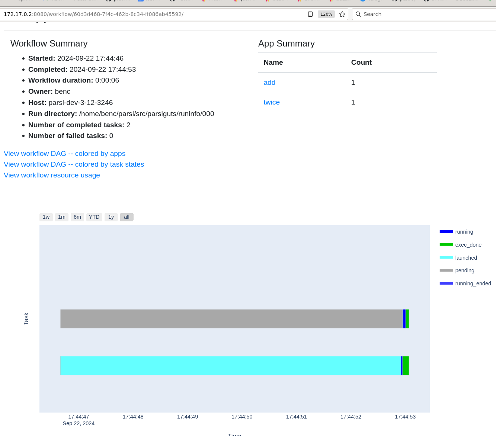

.. index:: SQL, monitoring, SQLite, SQLite
           library; sqlite3

Understanding the monitoring database
#####################################

Parsl can store information about workflow execution into an `SQLite database <https://www.sqlite.org/>`_. Then you can look at the information, in a few different ways.

.. index:: monitoring; configuration
           MonitoringHub

Turning on monitoring
=====================

Here's the workflow used in `taskpath`, but with monitoring turned on:

.. code-block:: python
  :emphasize-lines: 6,13-15,18

  import parsl

  def fresh_config():
    return parsl.Config(
      executors=[parsl.HighThroughputExecutor()],
      monitoring=parsl.MonitoringHub(hub_address = "localhost")
    )

  @parsl.python_app
  def add(x: int, y: int) -> int:
    return x+y

  @parsl.python_app
  def twice(x: int) -> int:
    return 2*x

  with parsl.load(fresh_config()):
    print(twice(add(5,3)).result())

Compared to the earlier version, the changes are adding ``monitoring=`` parameter to the Parsl configuration, and adding an additional app ``twice`` to make the workflow a bit more interesting.

After running this, you should see a new file, ``runinfo/monitoring.db``:

.. code-block::

  $ ls runinfo/
  000
  monitoring.db

This new file is an SQLite database shared between all workflow runs that use the same ``runinfo/`` directory.

Using monitoring information
============================

There are two main approaches to looking at the monitoring database: the prototype ``parsl-visualize`` tool, and Python data analysis.

.. index:: parsl-visualize
           monitoring; parsl-visualize

parsl-visualize web UI
----------------------

Parsl comes with a prototype browser-based visualizer for the monitoring database.

Start it like this, and then point your browser at the given URL.

.. code-block::

  $ parsl-visualize 
   * Serving Flask app 'parsl.monitoring.visualization.app'
   * Debug mode: off
  WARNING: This is a development server. Do not use it in a production deployment. Use a production WSGI server instead.
   * Running on http://127.0.0.1:8080
  Press CTRL+C to quit

Here's a screenshot, showing the above two-task workflow spending most of its 5 second run with the ``add`` task in ``launched`` state (waiting for a worker to be ready to run it), and the ``twice`` task in ``pending`` state (waiting for the ``add`` task to complete).

I'm not going to go further into ``parsl-visualize`` but you can run your own workflows and click around to explore.

.. index:: pandas
           monitoring; pandas
           library; pandas
           data frame

Using data frames
-----------------

A different approach preferred by many data-literate users is to treat monitoring data like any other Python data, using Pandas.

This example loads the entire task table (for all known workflows) into a data frame and then extracts the task completion times using Pandas notation:

.. code-block:: python

  import pandas as pd
  import sqlite3

  c = sqlite3.connect("runinfo/monitoring.db")
  df = pd.read_sql_query("SELECT * FROM task", c)
  c.close()

  print(df['task_time_returned'])

.. code-block::

  $ python3 panda_mon.py 
  0    2024-09-22 17:44:52.947501
  1    2024-09-22 17:44:53.005619
  Name: task_time_returned, dtype: object

.. todo:: one example of plotting

.. index:: monitoring; schema

What is stored in the database?
===============================

.. todo:: deeper dive into workflow/tasks/try table schema - not trying to be comprehensive of all schemas here but those three are a good set to deal with

The monitoring database SQL schema is defined using SQLAlchemy's object-relational model at `parsl/monitoring/db_manager.py line 132 onwards <https://github.com/Parsl/parsl/blob/3f2bf1865eea16cc44d6b7f8938a1ae1781c61fd/parsl/monitoring/db_manager.py#L132>`_.

.. warning:: The schema is defined a second time in `parsl/monitoring/visualization/models.py line 12 onwards <https://github.com/Parsl/parsl/blob/3f2bf1865eea16cc44d6b7f8938a1ae1781c61fd/parsl/monitoring/visualization/models.py#L12>`_. See `issue #2266 <https://github.com/Parsl/parsl/issues/2266>`_ for more discussion.

These tables are defined:

.. todo:: the core task-related tables can get a hierarchical diagram workflow/task/try+state/resource

* ``workflow`` - each workflow run gets a row in this table. A workflow run is one call to ``parsl.load()`` with monitoring enabled, and everything that happens inside that initialized Parsl instance.

* ``task`` - each task (so each invocation of a decorated app) gets a row in this table

* ``try`` - if/when Parsl tries to execute a task, the try will get a row in this table. As mentioned in `elaborating`, there might not be any tries, or there might be many tries.

* ``status`` - this records the changes of task status, which include changes known on the submit side (in ``TaskRecord``) and changes which are not otherwise known to the submit side: when a task starts and ends running on a worker. You'll see ``running`` and ``running_ended`` states in this table which will never appear in the ``TaskRecord``. One ``task`` row may have many ``status`` rows.

* ``resource`` - if Parsl resource monitoring is turned on (TODO: how?), a sub-mode of Parsl monitoring in general, then a resource monitor process will be placed alongside the task (see `elaborating`) which will report things like CPU time and memory usage periodically. Those reports will be stored in the resource table. So a try of a task may have many resource table rows.

* ``block`` - when the scaling code starts or ends a block, or asks for status of a block, it stores any changes into this table. If enough monitoring is turned on, the block where a try runs will be stored in the relevant ``try`` table row.

* ``node`` - this one is populated with information about connected worker pools with htex (and not at all with other executors), populated by the interchange when a pool registers or when it changes status (disconnects, is set to holding, etc)

